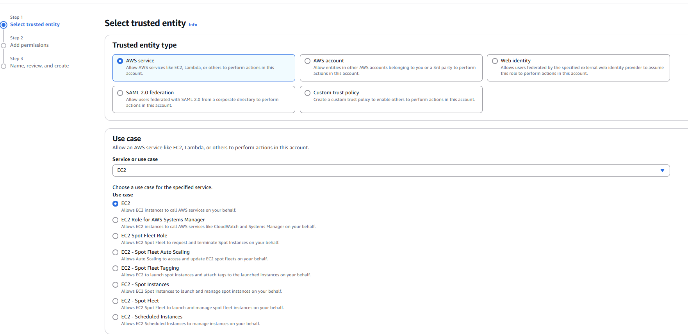
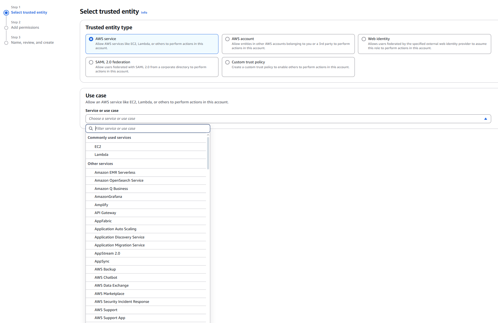

# SEC04-AWS100 — Create an IAM User

## Cloud Service Provider

* Amazon Web Services

## Difficulty
* Level 100 (Introductory)

## Objectives

### You need to complete the following:

* Create a new user in IAM with console access
* Add the user to an Admin group 
  * Create a new group called "Admins"
  * Add the `AdministratorAccess` managed policy to the new group
  * Add your new user to the "Admins" group
* Enable MFA for the root user
* Apply an IAM password policy that follows security best practices

### You need to answer the following: 

### ***What is Identity and Access Management (IAM)?***

**Identity and Access Management (IAM)** is a service provided by Amazon Web Services (AWS) that allows you to manage access to AWS resources securely. IAM helps you control who can authenticate (sign in) and be authorized (have permissions) to use resources. It enables fine-grained access control for individual users, groups, and services using policies. With IAM, you can specify who (identity) has what type of access (permissions) to which resources.

### ***What is a root user?***

A **root user** in AWS is the account created when you first set up an AWS account. It has **full, unrestricted access** to all AWS services and resources within that account. This user is linked to the email address used during the AWS account creation process. The root user is a highly privileged account and should only be used for the most sensitive administrative tasks like managing billing information or setting up service limits.

### ***How is a root user different from an Admin user?***

  - The **root user** has ultimate, unrestricted access to all AWS resources and services and cannot have its permissions limited or revoked.
  - An **Admin user** is a user created within IAM that can have **administrative privileges** similar to the root user but can be managed via IAM policies. The Admin user can be part of a group or have specific policies granting it administrative privileges, but it doesn't have as many inherent permissions as the root user (e.g., access to billing or closing the AWS account unless explicitly granted).

Best practice: Avoid using the root user regularly. Instead, create an Admin user for day-to-day administrative tasks and protect the root user with strong security measures (e.g., multi-factor authentication).

### ***What is console access and programmatic access?***

  - **Console Access:** This refers to access to the **AWS Management Console**, which is the web-based interface used to interact with AWS services. Users log in using a username, password, and optionally, MFA (Multi-Factor Authentication).
  - **Programmatic Access:** This allows users or applications to interact with AWS services via the AWS CLI (Command Line Interface), AWS SDKs (Software Development Kits), or APIs. To use programmatic access, users need Access Keys (comprising an Access Key ID and a Secret Access Key).

### ***What is the access key and secret key?***

  - **Access Key:** A combination of an Access Key ID and a Secret Access Key used to authenticate requests made programmatically to AWS services (via CLI, SDKs, or APIs).
  - **Access Key ID:** A public key that identifies the user making the programmatic request.
  - **Secret Access Key:** A private key that works in conjunction with the Access Key ID to securely sign the requests. The Secret Access Key should be kept confidential, as it grants access to AWS services.

### ***What is MFA and why is it important?***

**Multi-Factor Authentication (MFA)** is a security mechanism that requires users to provide two forms of identification to access AWS resources. Typically, it involves something the user knows (a password) and something the user has (like a one-time code generated by an MFA device or app).

**Importance:**

  - It adds an extra layer of security, reducing the likelihood of unauthorized access.
  - Protects against account compromise in case passwords are stolen or guessed.
  - It is especially recommended for the root user account, Admin users, and any accounts with high-level permissions.

### ***What are policies and how can you create them?***

**Policies** in AWS IAM are JSON documents that define permissions. These policies specify what actions are allowed or denied for specific AWS resources. Policies can be attached to IAM users, groups, or roles to control access.

  - **Managed Policies:** Predefined policies by AWS or custom policies that can be reused across multiple users, groups, or roles.
  - **Inline Policies:** Policies that are directly attached to a single user, group, or role.

**How to Create a Policy:**

1. Navigate to the **IAM Management Console.**
2. Select **Policies** from the left-hand menu.
3. Click on **Create Policy**.
4. You can either use the **Visual Editor** or write the JSON manually.
5. Define the permissions by specifying the **service**, **actions**, and **resources**.
6. Optionally, you can add conditions that further restrict access based on specific criteria.
7. Review and create the policy.

### ***What are roles and how can you create them?***

**Roles** in AWS IAM are identities with specific permissions that can be assumed by users, services, or applications. Unlike users, roles don’t have permanent credentials. Instead, they allow trusted entities to assume the role and temporarily gain its permissions.

**How to Create a Role:**

1. Navigate to the **IAM Console.**
2. Select **Roles** from the left-hand menu.
3. Click on **Create Role.**
4. Choose the trusted entity (AWS service, another AWS account, or a web identity provider).
5. Attach the necessary permissions (via a policy).
6. Optionally, add tags to help organize or track the role.
7. Name the role and create it.

### ***What is the difference between a role and a policy?***

  -  A **policy** defines what actions are allowed or denied on AWS resources. It can be attached to users, groups, or roles to define their permissions.
  -  A role is an identity that users or services can assume to temporarily gain certain permissions. A role doesn’t have static credentials like a user, but it can use policies to specify what actions are allowed when the role is assumed.

### ***What is a user group?***

A **user group** in AWS IAM is a collection of IAM users that share the same set of permissions. Instead of assigning permissions to individual users, you can create a user group and attach policies to it. All users within the group inherit the permissions assigned to the group.

**Example:** You can create a "Developers" group, attach a policy granting access to certain development resources, and add all relevant users to that group. All users in the group will inherit those permissions.

### ***What are some good security practices for password policies?***

Good security practices for **password policies** include:

1. **Enforce Password Complexity:** Require strong passwords that include a combination of uppercase letters, lowercase letters, numbers, and special characters.
2. **Minimum Password Length:** Set a minimum password length (e.g., at least 12 characters).
3. **Password Expiration:** Require users to change their passwords regularly (e.g., every 90 days).
4. **Disallow Reuse of Old Passwords:** Prevent users from reusing their last few passwords (e.g., disallow the last 5 passwords).
5. **MFA Enforcement:** Require MFA for added security alongside passwords.
6. **Account Lockout After Failed Attempts:** Automatically lock accounts after a certain number of failed login attempts to prevent brute-force attacks.
7. **Password Rotation:** Encourage regular password changes and updates.
8. **Monitor for Compromised Credentials:** Use AWS services or third-party tools to monitor for any password leaks or compromises.

## References

* [Creating Your First IAM Admin User and Group](https://docs.aws.amazon.com/IAM/latest/UserGuide/getting-started_create-admin-group.html)
* [Security Best Practices in IAM](https://docs.aws.amazon.com/IAM/latest/UserGuide/best-practices.html)
* [Root user in AWS](https://docs.aws.amazon.com/IAM/latest/UserGuide/id_root-user.html)
* [Setting an IAM password policy](https://docs.aws.amazon.com/IAM/latest/UserGuide/id_credentials_passwords_account-policy.html?icmpid=docs_iam_console)
* [IAM Policy examples](https://docs.aws.amazon.com/IAM/latest/UserGuide/access_policies_examples.html)
* [About IAM Roles](https://docs.aws.amazon.com/IAM/latest/UserGuide/id_roles.html)

## Cost
* Included in the Free Tier

## Estimated time:
 * 10 minutes

## Tips
* Managed policies are created and maintained by AWS. A managed policy has a small, orange box on the left side of the policy's name.
* Use the [Google Authenticator](https://play.google.com/store/apps/details?id=com.google.android.apps.authenticator2) app for MFA.
* Do not ever commit, add or push any of your access and secret keys to source control systems like git. You must also never share or make your access keys public in any way shape or form. If you accidentaly have done so, make sure to delete the access and secret keys immediately in your console and generate new ones.
* By default, IAM users are not allowed access to the Billing console. It has to be enabled seperately by using the root user under "My Account".
