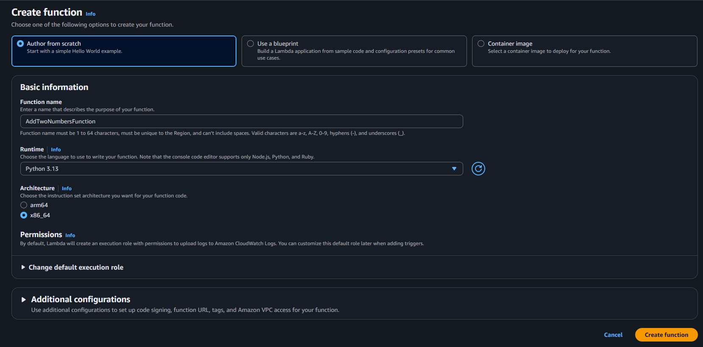
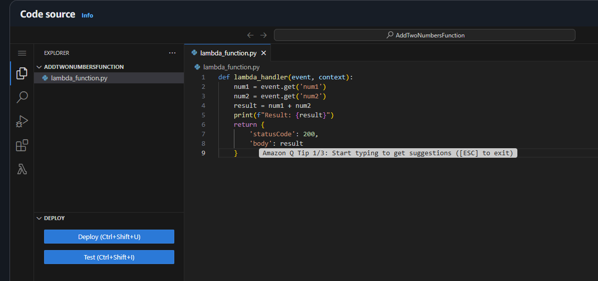
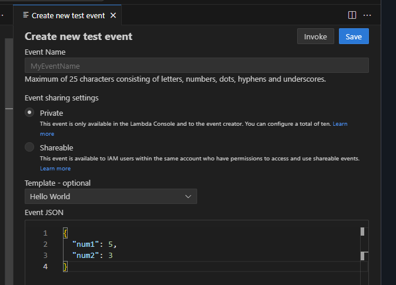
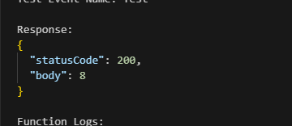

# 🧮 Create an AWS Lambda Function to Add Two Numbers

## ☁️ Cloud Service Provider
- **Amazon Web Services (AWS)**

## 🎯 Difficulty
- **Level 100 (Introductory)**

---

## ✅ Objectives

### What You Will Do

- Create an AWS Lambda function in the programming language of your choice to add two input numbers and return the result.
- Log the result to **Amazon CloudWatch**.

---

## 🚀 Step-by-Step Instructions

### 1. Create the Lambda Function

1. Sign in to the [AWS Console](https://aws.amazon.com/console/) and open the **Lambda** service.
2. Click **Create function** and choose **Author from scratch**.
3. Configure:
   - **Function name:** `AddTwoNumbersFunction`
   - **Runtime:** Choose Python, Node.js, or any supported language.
   - **Permissions:** Choose or create a role with basic Lambda permissions.
4. Click **Create function**.


### 2. Add the Code

Paste the following sample code into the editor (Python example):

```python
def lambda_handler(event, context):
    num1 = event.get('num1')
    num2 = event.get('num2')
    result = num1 + num2
    print(f"Result: {result}")
    return {
        'statusCode': 200,
        'body': result
    }
````

Click **Deploy** to save.



### 3. Test the Function

1. Click the **Test** tab.
2. Create a new test event:

```json
{
  "num1": 5,
  "num2": 3
}
```


3. Run the test and check the output in the **Execution results** panel.



---

## 💡 Conceptual Questions & Answers

### ❓ What is Function as a Service (FaaS)?

Function as a Service allows developers to run code in response to events without managing servers. **AWS Lambda** is a leading FaaS offering that handles scaling, execution, and infrastructure. You pay only for the compute time consumed.

---

### 🌐 How Many Languages Does AWS Lambda Support?

* **Node.js** (JavaScript)
* **Python**
* **Ruby**
* **Java (8 & 11)**
* **Go**
* **C# (.NET Core)**
* **PowerShell**

You can also use **custom runtimes** for other languages via Lambda layers.

---

### 🧠 What is the Maximum Memory for a Lambda Function?

AWS Lambda supports memory allocation from **128 MB to 10,240 MB (10 GB)**, adjustable in 64 MB increments.

---

### 📦 Deployment Methods

* AWS Management Console
* AWS CLI
* AWS SDKs (e.g., Python `boto3`, JavaScript)
* AWS SAM (Serverless Application Model)
* AWS CloudFormation (IaC)
* AWS CodePipeline / CodeDeploy (CI/CD)

---

### 🧑‍💻 Using AWS Cloud9 IDE

1. Open **AWS Cloud9** from the console.
2. Create a new environment.
3. Use the built-in editor and terminal to write, run, and debug code.
4. Install packages with the terminal (`pip`, `npm`, etc.).
5. Run scripts directly from the IDE.

---

### 🧪 Testing a Lambda Function

**Console:**

* Click **Test**, add a test event, and view the results.

**CLI:**

```bash
aws lambda invoke \
  --function-name AddTwoNumbersFunction \
  --payload file://input.json \
  output.txt
```

**IDE (Cloud9, VS Code):**

* Use SDKs or **SAM CLI** to test locally.

---

### 📊 What is Amazon CloudWatch?

**Amazon CloudWatch** is a monitoring service that collects metrics and logs from AWS services. It enables:

* Real-time performance monitoring
* Alerts based on custom thresholds
* Centralized logging (e.g., Lambda, EC2)

---

### 🔍 Viewing Lambda Logs

**Option 1: AWS Console**

* Navigate to **CloudWatch > Logs**.
* Find the log group `/aws/lambda/<function-name>`.
* View execution logs.

**Option 2: CLI**

```bash
aws logs tail /aws/lambda/<function-name> --follow
```

**Option 3: Lambda Console**

* Go to the **Monitoring** tab.
* Click **View logs in CloudWatch**.

---

## 📚 References

* [AWS Lambda – Getting Started](https://aws.amazon.com/lambda/getting-started/)
* [AWS CloudWatch Logs](https://docs.aws.amazon.com/AmazonCloudWatch/latest/logs/WhatIsCloudWatchLogs.html)
* [Check AWS Lambda Logs](https://docs.aws.amazon.com/lambda/latest/dg/monitoring-cloudwatchlogs.html)
* [Test AWS Lambda](https://docs.aws.amazon.com/lambda/latest/dg/getting-started-create-function.html)

---

## 💰 Estimated Cost

AWS Lambda’s **free tier** includes:

* **1M free requests per month**
* **400,000 GB-seconds of compute time per month**

---

## ⏱ Estimated Time

* Around **10 minutes**

---

## 💡 Additional Ideas

Use the **default Lambda Hello World template** with parameters `event` and `context`. The `event` object receives input data during testing. Build from this foundation to create more complex logic.

---

## 🛠 Tips

Start with **Cloud9 IDE** for development and testing. Then explore other deployment methods such as **ZIP uploads**, **SAM CLI**, and **CI/CD pipelines** for more advanced workflows.

```

---