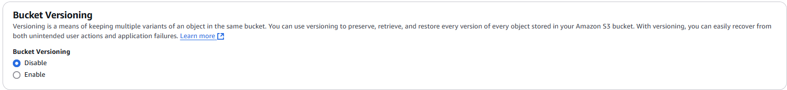

# AWS100 - Create an S3 Bucket and store an object in it

## Cloud Service Provider
- Amazon Web Services

## Difficulty
- Level 100 (Introductory)

## Objectives

### You need to complete the following:

- Using the console, create an S3 bucket
- Upload an object (any file) into the bucket

### You need to answer the following:

### ***What is Simple Storage Service (S3)?***

Amazon Simple Storage Service (S3) is a scalable, high-availability cloud-based object storage service. It allows users to store and retrieve any amount of data from anywhere on the web. S3 provides an easy-to-use web interface and supports use cases like backup and recovery, data archiving, application hosting, and big data analytics. It offers features like versioning, lifecycle policies, and event triggers.

### ***What is a bucket?***

A **bucket** in Amazon S3 is a container for storing objects (data files). Buckets are used to organize and manage objects, similar to how directories are used in file systems. Each bucket has a globally unique name and is associated with a region, and users can apply access permissions and policies at the bucket level to control access to the data.

***Bucket Type***
- **General purpose buckets:** A general purpose bucket is the default Amazon S3 bucket type. General purpose buckets are recommended for the majority of use cases in Amazon S3. These buckets support most Amazon S3 storage classes and all Amazon S3 features.

- **Directory bucket:** A directory bucket is an Amazon S3 bucket type that is used for workloads or performance-critical applications that require consistent single-digit millisecond latency. Directory buckets organize data hierarchically into directories, and can elastically scale performance to support hundreds of thousands of transactions per second (TPS). Directory buckets support only the S3 Express One Zone storage class and a limited set of Amazon S3 features.

### ***What is object storage?***

**Object storage** is a storage architecture that manages data as objects, as opposed to block or file storage. In Amazon S3, each object consists of data, metadata (which describes the object), and a unique identifier. Object storage is designed for storing large amounts of unstructured data like images, videos, backups, and archives. It provides scalability, durability, and flexibility.

### ***How is object storage different than block storage?***

- **Object storage** (e.g., S3) manages data as discrete objects, each with its metadata and a unique identifier. It is ideal for unstructured data (media, backups) and provides high scalability and durability.
- **Block storage** (e.g., Amazon EBS) manages data as fixed-size blocks and is optimized for performance in databases and transactional systems. It’s similar to the way a hard drive works, allowing data to be split into smaller chunks (blocks) that can be modified independently.

### ***What is the maximum amount of data that you can store in an S3 bucket?***

There is **no limit** to the amount of data you can store in an S3 bucket. However, each AWS account can create up to 100 buckets by default (this limit can be increased by requesting a quota adjustment).

### ***What is the maximum file size you can store in an S3 bucket?***

The maximum file (object) size you can upload to S3 is **5 terabytes (TB)**. Largest single upload is capped at 5 gigabytes (GB) unless using multipart upload features.

### ***Bucket Versioning***
Versioning in Amazon S3 is a means of keeping multiple variants of an object in the same bucket. You can use the S3 Versioning feature to preserve, retrieve, and restore every version of every object stored in your buckets. With versioning you can recover more easily from both unintended user actions and application failures. After versioning is enabled for a bucket, if Amazon S3 receives multiple write requests for the same object simultaneously, it stores all of those objects.

### ***By default, are objects in an S3 bucket public?***

No, by default, objects in an S3 bucket are private. Only the owner of the bucket has access to the objects unless they explicitly grant access to others using bucket policies, access control lists (ACLs), or IAM policies.

### ***What are the security best practices regarding S3 buckets?***

- **Restrict public access:** Use bucket policies, ACLs, and block public access settings to prevent unintended exposure.
- **Use encryption:** Encrypt data at rest using server-side encryption (SSE-S3, SSE-KMS, SSE-C) and in transit using SSL/TLS.
- **Enable logging and monitoring:** Enable S3 access logs and AWS CloudTrail for auditing access and changes.
- **Use IAM roles and policies:** Grant least-privileged access through IAM roles and policies.
- **Enable MFA delete:** Add an extra layer of security by requiring multi-factor authentication (MFA) to delete objects.

### ***What is an S3 bucket policy?***

An **S3 bucket policy** is a JSON-based document that defines specific actions that are allowed or denied for certain users, roles, or services on the S3 bucket. It allows bucket owners to grant or restrict permissions on a bucket and its objects. Bucket policies can control access across multiple users and enforce conditions like IP address restrictions or encryption requirements.

### ***What are storage classes in S3?***

S3 provides different storage classes that allow users to optimize storage costs based on usage patterns. These include:

- **S3 Standard:** General-purpose storage for frequently accessed data.
- **S3 Intelligent-Tiering:** Automatically moves data between two access tiers based on changing access patterns.
- **S3 Standard-IA (Infrequent Access):** For data that is accessed less frequently but needs to be retrieved quickly.
- **S3 One Zone-IA:** Similar to Standard-IA, but stores data in a single availability zone (lower cost, less redundancy).
- **S3 Glacier:** Low-cost storage for archival and long-term backup, with retrieval times ranging from minutes to hours.
- **S3 Glacier Deep Archive:** The lowest-cost storage option, designed for data that is rarely accessed, with retrieval times of 12 hours or more.

### ***How is a bucket policy different from an IAM policy?***

- **Bucket policy:** Applied directly to an S3 bucket and controls access to the bucket and its objects. It defines who can perform what actions (like read, write) on the bucket and can be used for cross-account access control.
- **IAM policy:** Applied to AWS Identity and Access Management (IAM) users, groups, or roles, and defines what actions they can perform on AWS resources. IAM policies are broader and apply across AWS services, not just S3.

## References
- [Getting Started with S3](https://docs.aws.amazon.com/AmazonS3/latest/gsg/GetStartedWithS3.html)
- [Bucket Policies](https://docs.aws.amazon.com/AmazonS3/latest/dev/access-policy-language-overview.html)
- [Storage classes in S3](https://aws.amazon.com/s3/storage-classes/)

## Costs
- This project is included in the free tier.
- The free tier includes 5GB of Amazon S3 storage in the S3 Standard storage class; 20,000 GET Requests; 2,000 PUT, COPY, POST, or LIST Requests; and 15GB of Data Transfer Out each month.
- An empty bucket does not incur any costs.
- [S3 Pricing after free tier exhaustion](https://aws.amazon.com/s3/pricing/?nc=sn&loc=4)

## Estimated time to complete
- 5 minutes

## Tips
- Each bucket's name has to be unique _globally_, across every single bucket in the world.
- Try to get the URL for the object you uploaded in this task and access it using a browser, you should get an access denied error
- Do not store sensitive information in a bucket that has public access.
- Do not turn on _versioning_ on this bucket, it will be difficult to delete.

## Output
