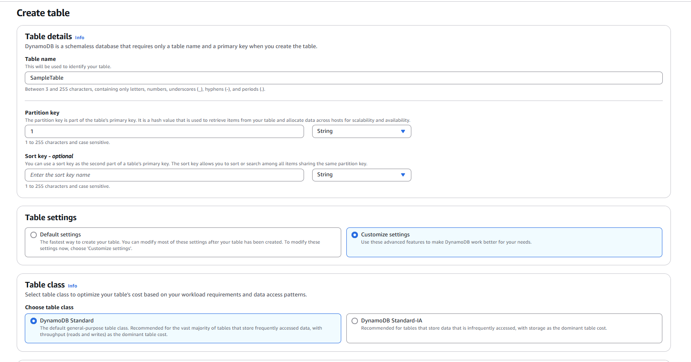
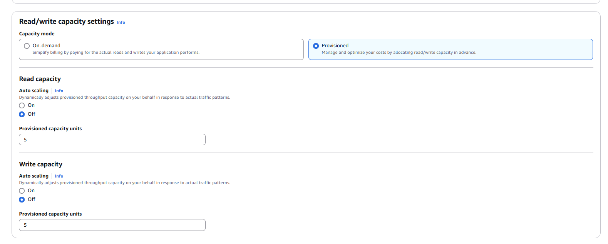
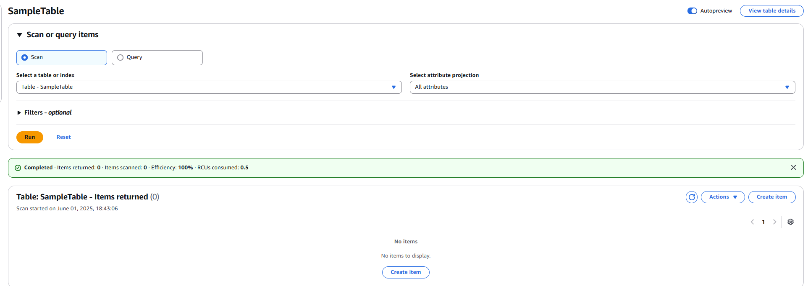

# Create a DynamoDB table

## Cloud Service Provider

* Amazon Web Services

## Difficulty

* Level 100 (Introductory)


## Objectives

### You need to complete the following:

* Create a DynamoDB table with provisioned capacity
* Create three random items in the table
* Run a scan on the table that returns all three items
* Run a query on the table that returns a single item

---

### ➕ **Step-by-Step Instructions**

#### ✅ **1. Create a DynamoDB table with provisioned capacity**

1. Log in to the [AWS Console](https://console.aws.amazon.com/).
2. Navigate to the **DynamoDB** service by searching for “DynamoDB” in the top search bar.
3. Click on **“Create table.”**
4. Configure the table:

   * **Table name:** `SampleTable` (or any name you prefer)
   * **Partition key:** `id` (type: Number)
   * Leave **Sort key** unchecked (not needed for this project)
5. In the **Table settings** section:

   * Select **Provisioned** capacity mode
   * Set **Read capacity units (RCU):** `5`
   * Set **Write capacity units (WCU):** `5`
6. Click **“Create table.”**

> 🧠 **Explanation:** Provisioned mode lets you manually control the number of reads and writes per second. It’s useful for predictable workloads and helps manage cost more precisely than on-demand mode.



---

#### ✅ **2. Create three random items in the table**

1. Once the table is created, open it and go to the **“Explore table items”** tab.
2. Click **“Create item.”**
3. Choose **JSON view** or use the **tree view** to enter the item data. For example:

```json
{
  "id": { "S": "1" },
  "name": { "S": "Alice" },
  "age": { "N": "29" }
}
```

4. Click **“Create item.”**
5. Repeat steps 2–4 for two more entries, such as:

```json
{
  "id": { "S": "2" },
  "name": { "S": "Bob" },
  "age": { "N": "34" }
}
```

```json
{
  "id": { "S": "3" },
  "name": { "S": "Carol" },
  "age": { "N": "41" }
}
```

> 🧠 **Explanation:** Each item represents a set of key-value attributes and is uniquely identified by its partition key (`id`). You’re creating three distinct items for later retrieval.



---

#### ✅ **3. Run a scan on the table that returns all three items**

1. Navigate to the **“Explore table items”** section of your table.
2. Click the **“Run”** button without adding any filters.

> 🧠 **Explanation:** A scan operation reads all items in the table and returns them. This is useful for small datasets or when you need to retrieve all records, but it’s less efficient for large tables.

---

#### ✅ **4. Run a query on the table that returns a single item**

1. In the same **“Explore table items”** tab, click the **“Query”** option.
2. Set the partition key to an existing value (e.g., `id = 2`).
3. Click **“Run.”**

> 🧠 **Explanation:** A query operation searches based on a specific partition key and returns matching items. It is optimized for performance and cost-efficiency compared to scans.


---

### You need to answer the following:

### ***What is an "item" in DynamoDB?***

An **item** in DynamoDB is a collection of attributes (key-value pairs), analogous to a row in a relational database. Each item is uniquely identified by a **primary key**, which consists of a partition key (and optionally, a sort key). Items are stored in **tables**, which hold a set of items.

### ***What data types can you store in a DynamoDB table?***

DynamoDB supports three primary types of data:

* **Scalar Types**:

  * String
  * Number
  * Binary
  * Boolean
  * Null
* **Document Types**

  * Map (similar to JSON objects)
  * List (similar to arrays or lists)
* **Set Types**

  * String Set
  * Number Set
  * Binary Set

### ***What is the maximum size of an item in DynamoDB?***

The maximum size of an item (including all attributes) in DynamoDB is **400 KB**.

### ***What capacity modes are available for DynamoDB?***

DynamoDB supports two capacity modes:

* **Provisioned Mode:** You specify the number of read and write capacity units (RCUs/WCUs) required.
* **On-Demand Mode:** DynamoDB automatically adjusts to handle traffic without capacity planning.

### ***What are Write Capacity and Read Capacity Units (WCU/RCU)?***

* **Write Capacity Unit (WCU):** The throughput required for one write request per second for an item up to 1 KB in size.
* **Read Capacity Unit (RCU):** The throughput required for one strongly consistent read request per second for an item up to 4 KB in size. For eventually consistent reads, one RCU can handle two reads per second for items up to 4 KB.

### ***What is the size of a single WCU and RCU?***

* **1 WCU:** Handles writing 1 KB of data per second.
* **1 RCU:** Handles reading 4 KB of data per second for strongly consistent reads, and up to 8 KB for eventually consistent reads.

### ***How does DynamoDB support autoscaling?***

DynamoDB supports **auto-scaling** by automatically adjusting provisioned capacity (RCUs and WCUs) in response to traffic patterns. It uses predefined policies to scale capacity up or down based on utilization metrics to meet changes in demand while avoiding over-provisioning.

### ***Does DynamoDB support encryption?***

Yes, DynamoDB supports **encryption at rest** using **AWS Key Management Service (KMS)**. Encryption is automatically enabled for all tables, and customers can either use the default AWS-managed key or a customer-managed key.

### ***Which key type is required for creating a table?***

To create a DynamoDB table, you must define a primary key. There are two types of primary keys:

* **Partition Key (Hash Key):** A single attribute is used as the primary key to uniquely identify items.
* **Composite Key (Partition Key + Sort Key):** A combination of two attributes (partition key and sort key) is used to identify items, allowing for multiple items to share the same partition key but still be uniquely identified by the sort key.

### ***Which three data types does the Primary Key support?***

DynamoDB primary keys can be of three types:

* **String**
* **Number**
* **Binary**

### ***What is the difference between a Primary (Hash) Key and a Secondary (Sort) Key?***

* **Primary Key (Hash Key):** Uniquely identifies an item in a table. It can either be a partition key or a composite key (partition + sort key).
* **Secondary Key (Sort Key):** When used in conjunction with a partition key, the sort key provides an additional level of uniqueness within a partition. This allows multiple items with the same partition key to be stored and distinguished by different sort keys.

### ***What is a DynamoDB Stream?***

A **DynamoDB Stream** is a time-ordered sequence of item-level changes in a DynamoDB table. It allows you to capture changes (insert, update, delete) to table items, and these changes can be processed by other AWS services (such as AWS Lambda) for real-time updates, replication, or analytics.

### ***What are Global Tables?***

**Global Tables** in DynamoDB provide multi-region, fully replicated tables. This allows you to replicate data automatically across multiple AWS regions, ensuring low-latency reads and writes and improving availability in case of regional outages.

### ***How do backups work in DynamoDB?***

DynamoDB provides **on-demand backups** and **continuous backups** (using Point-in-Time Recovery or PITR).

* **On-Demand Backups:** You can manually create a full backup of your table data at any time.
* **PITR:** DynamoDB can automatically back up your data every few seconds and allows you to restore the table to any point within the last 35 days.

### ***Can DynamoDB be performant at-scale?***

Yes, DynamoDB is designed to scale horizontally. It automatically partitions and distributes data across multiple servers for high throughput and low-latency performance. Its **on-demand mode**, **autoscaling**, **global tables**, and **DynamoDB Accelerator (DAX)** provide additional mechanisms to ensure performant, low-latency responses even at massive scale, supporting trillions of requests per day.

---

## References

* [AWS Create and Query a NoSQL Table](https://aws.amazon.com/getting-started/hands-on/create-nosql-table/)
* [DynamoDB FAQs](https://aws.amazon.com/dynamodb/faqs/)

## Costs

* 25GB of storage is included in the free tier
* 25 WCUs/RCUs are included in the free tier

## Estimated time to complete

* 30 minutes

## Tips

* Use numbers as your Primary Keys for this getting started project.
* Do not use a sort key for this project.

---
